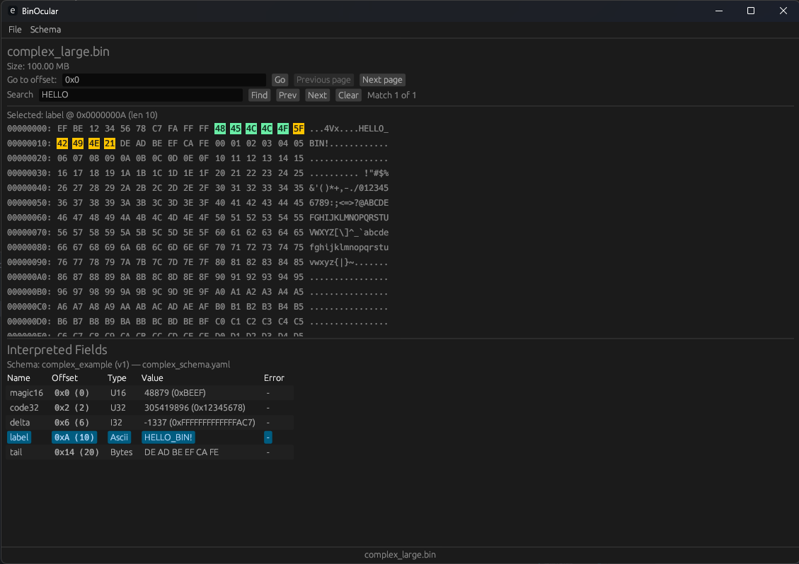

<p align="center">
  
</p>
<p align="center"><i>BinOcular - Know your bytes. Don't guess them.</i></p>
<p align="center">
  <a href="https://github.com/bburd/BinOcular/actions/workflows/ci.yml">
    
  </a>
  <a href="https://github.com/bburd/BinOcular/releases">
    
  </a>
  <a href="https://github.com/bburd/BinOcular/blob/main/LICENSE">
    
  </a>
</p>

# BinOcular

BinOcular is a schema-driven binary inspection toolkit written in Rust. It helps you describe binary layouts with YAML, inspect files through a CLI or GUI, and connect interpreted fields back to the raw bytes that produced them.

Use it when you have a binary file, some knowledge of its structure, and want a repeatable way to explore offsets, lengths, strings, integers, and payloads without guessing in a hex editor.

## Features

### Schema System

- YAML-based binary schemas
- File includes and fixed-count repeats
- Dynamic lengths and offsets from earlier fields
- Conditional fields and structure instances with `when`
- Simple integer expressions (`add` / `sub`)
- Reusable structures that expand to flat dotted field names

### Inspection

- CLI table and JSON output
- Interactive GUI hex viewer
- Field-to-byte highlighting
- ASCII search with match highlighting
- Windowed/paged hex viewing for large files
- Memory-mapped file access

### Reliability

- Read-only operation
- Memory-safe Rust implementation
- Parser/interpreter hardening with property and crash-harness tests
- Tagged release artifacts with SHA256 checksums and a machine-readable manifest

## Quickstart

Build the workspace:

```bash
cargo build --workspace
```

Create a tiny sample file:

```bash
python - <<'PY'
with open('packet.bin', 'wb') as f:
    f.write((12).to_bytes(2, 'little'))
    f.write((16).to_bytes(4, 'little'))
    f.write((7).to_bytes(2, 'little'))
    f.write(b'\x00' * 8)
    f.write(b'CAT')
    f.write(b'END')
PY
```

Create `packet.yml`:

```yaml
schema_name: "Packet"
schema_version: 1
endianness: little
fields:
  - name: "header_len"
    type: u16
    offset: { kind: Absolute, value: 0 }

  - name: "data_offset"
    type: u32
    offset: { kind: Absolute, value: 2 }

  - name: "payload_len"
    type: u16
    offset: { kind: Absolute, value: 6 }

  - name: "payload"
    type: bytes
    offset: { kind: FieldRef, value: data_offset }
    length:
      expr:
        op: sub
        left: { field: "payload_len" }
        right: { const: 4 }

  - name: "tag"
    type: ascii
    offset:
      kind: Expr
      value:
        op: add
        left: { field: "data_offset" }
        right: { const: 3 }
    length: 3
```

Run the CLI:

```bash
cargo run -p binocular-cli -- --schema packet.yml packet.bin
```

Schemas can also define reusable structures and instantiate them at offsets:

```yaml
schema_name: "Structured Packet"
schema_version: 1
endianness: little
structures:
  - name: header
    fields:
      - name: magic
        type: u16
        offset: { kind: Relative, value: 0 }
      - name: length
        type: u16
        offset: { kind: Relative, value: 2 }
fields:
  - name: header
    struct: header
    offset: { kind: Absolute, value: 0 }
```

This emits flat rows such as `header.magic` and `header.length`, so CLI and GUI output stay table-friendly.

Fields and structure instances can be conditional on earlier numeric values:

```yaml
fields:
  - name: product_code
    type: u16
    offset: { kind: Absolute, value: 0 }

  - name: radial_packet
    struct: radial_packet
    offset: { kind: Absolute, value: 64 }
    when:
      field: product_code
      equals: 94

  - name: extra_flags
    type: bytes
    offset: { kind: Absolute, value: 128 }
    length: 4
    when:
      field: flags
      bit_set: 2
```

When a condition is false, the item is omitted from interpreted output.

Example output:

```text
NAME       | OFFSET            | TYPE        | VALUE      | ERROR
header_len | 0 (0x00000000)    | u16         | 12         | -
data_offset| 2 (0x00000002)    | u32         | 16         | -
payload_len| 6 (0x00000006)    | u16         | 7          | -
payload    | 16 (0x00000010)   | bytes[3]    | 43 41 54   | -
tag        | 19 (0x00000013)   | ascii[3]    | "END"      | -
```

Run the GUI:

```bash
cargo run -p binocular-gui
```

## GUI

<p align="left">
  
</p>

The GUI can:

- Open binary files
- Load YAML schemas
- Display and navigate paged hex windows
- Click interpreted fields to highlight bytes
- Search ASCII text and highlight matches

## Current Capabilities

As of v0.8.0, BinOcular supports:

- Dynamic schema-driven parsing
- Repeat fields and schema includes
- Reusable schema structures with flat output names
- Runtime-computed lengths and offsets
- Conditional scalar fields and structure instances
- Interactive GUI inspection with highlighting and search
- Large-file mmap-backed inspection

## Current Limitations

BinOcular is currently read-only. It is a binary inspection tool, not a full hex editor.

Not currently supported:

- Nested struct instances
- Multiplication/division in expressions
- Regex search
- Hex-pattern search
- CLI search
- Plugins
- Editing bytes
- Binary diff
- Installers or code signing

## Release Verification

Tagged releases include:

- release archives for supported platforms
- `SHA256SUMS`
- `manifest.json`

Users can verify a downloaded artifact by comparing its SHA256 hash against `SHA256SUMS`.

## Roadmap

Planned areas of expansion include:

- Nested struct instances
- Richer expressions and conditionals
- Additional search and navigation tools
- Plugin system

## Learn More

- `crates/binocular-core` - core buffer abstractions and field interpreter
- `crates/binocular-schema` - YAML AST, parser, and schema validation
- `crates/binocular-cli` - command-line tool for inspecting binaries
- `crates/binocular-gui` - egui desktop application

## Contributing

BinOcular is still evolving. Issues, ideas, and design discussions are welcome, especially around schema clarity, new field types, UX, and testing.

## License

MIT License - see [`LICENSE`](LICENSE) for details.
