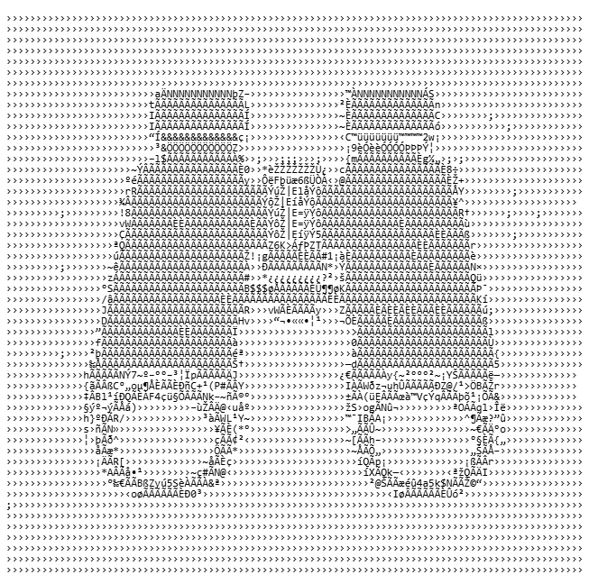

<p align="center">
  
</p>
<p align="center"><i>BinOcular - Know your bytes. Don't guess them.</i></p>

# BinOcular
*A schema-driven binary inspection toolkit for developers, reverse-engineers, and anyone who wants to stop guessing about byte layouts.*

BinOcular is a portable, cross-platform binary analysis toolkit written in Rust.  
It provides a structured, declarative way to explore unknown binary formats, visualize data layouts, and build custom parsers - without guesswork or hex-editor archaeology.

This workspace includes both a CLI and a GUI, with a long-term goal of becoming a robust open-source binary inspection suite.

## Features

- **Portable** - Windows-first, with Linux/macOS support planned  
- **Fast & Safe** - Rust's safety guarantees without sacrificing performance  
- **Schema-Driven** - Describe binary structures using a clean YAML layout format with reusable includes and fixed-count repeats  
- **Precise Visualization** - Offsets, endian behavior, integers, strings, blobs  
- **Repeat Field Support** - Fixed-count repeated fields expanded into multiple rows  
- **Schema Includes** - Compose schemas from reusable YAML files  
- **Interactive Highlighting** - Click fields in the GUI to highlight corresponding bytes in the hex view  
- **GUI Buffer Abstraction** - GUI reads through the same buffer layer used across the workspace  
- **Large-File mmap Backend** - Memory-mapped backend for efficient access to large binaries  
- **Windowed/Paged Hex View** - Hex display reads a page/window at a time instead of loading whole files  
- **Developer-Friendly** - CLI output (table or JSON) for automation and testing  

## Project Status

Active development (**v0.4.0**).  
The core schema engine, interpreter, CLI, and GUI MVP are functional.  
Current schema support includes reusable file-based includes and fixed-count repeats, and the GUI supports field-to-byte highlighting on top of the buffer abstraction, memory-mapped backend, and windowed/paged hex-view strategy for large files.

## v0.2.0 Hardening Summary

**TL;DR:** v0.2.0 made BinOcular crash-resistant.

### What changed

- Removed panic paths in the interpreter (including `unwrap` in numeric decoding)
- Added property tests for schema parsing and validation
- Added a randomized crash harness for the end-to-end pipeline

### What it means

- Arbitrary or malformed input now yields structured errors instead of crashes
- Much higher confidence in stability across parser + interpreter + CLI flow

### What didn't change

- No new features
- No schema expansion
- No UI changes


## v0.3.0 Large-File Support

**TL;DR:** v0.3.0 makes BinOcular scale.

### What changed

- Introduced buffer abstraction (`Arc<dyn FileBuffer>`)
- Added `MmapBuffer` backend for large files
- Implemented automatic file-loading strategy (memory for small, mmap for large)
- Replaced preview hex view with windowed paging (Prev / Next / Go to offset)
- Added correctness tests for mmap behavior and bounds handling

### What it means

- BinOcular can efficiently inspect large files without loading them entirely into memory
- Hex view now supports navigation across the full file, not just a preview
- Backends are interchangeable with identical behavior guarantees

### What didn't change

- Still read-only
- No schema expansion
- No plugins or editing features

## v0.4.0 Schema & Interaction Features

**TL;DR:** v0.4.0 adds real schema composition and interactive inspection.

### What changed

- Added fixed-count repeat support (`repeat: { count: N }`)
- Added file-based schema includes (`include: path.yaml`)
- GUI now supports clicking fields to highlight bytes in the hex view
- Interpreter now expands repeated fields into multiple rows

### What it means

- Schemas can now model real-world binary layouts more accurately
- Shared schema components can be reused across files
- GUI interaction now directly connects structure to raw bytes

### What didn't change

- Still read-only
- No nested structures or expressions yet
- No editing or plugin system

## Roadmap (High-Level)

- [x] Field interpreter & offset model  
- [x] Schema parser + validation  
- [x] CLI table + JSON output  
- [x] GUI MVP (hex view + interpreted fields)  
- [x] Paging-backed hex viewer for large files  
- [x] Property tests and fuzzing hardening
- [x] Fixed-count repeat support
- [x] Schema include support
- [x] GUI field-to-byte highlighting
- [ ] Plugin/interface system  
- [ ] Advanced schema features (expressions, nested structures)  


## Scope (Current vs Out of Scope)

BinOcular is currently **read-only**. It is a binary inspection tool, **not** a full hex editor.

### In Scope (Current)

- Schema-driven parsing and field interpretation
- Fixed-count repeats
- File-based schema composition
- GUI buffer abstraction
- mmap backend for large files
- Windowed/paged hex viewing
- GUI field-to-byte highlighting

### Explicitly Out of Scope (Current)

- Nested schemas
- Conditional fields
- Expressions
- Plugins
- Full virtual scrolling
- Editing bytes
- Binary diff

## Workspace Layout

- `crates/binocular-core` - core buffer abstractions and field interpreter  
- `crates/binocular-schema` - YAML AST, parser, and schema validation  
- `crates/binocular-cli` - command-line tool for inspecting binaries  
- `crates/binocular-gui` - egui desktop application  

## Quickstart

1. Install the Rust toolchain (Rust 1.76+ recommended)
2. Build all crates:

```bash
cargo build --workspace
```

3. Run the full test suite:

```bash
cargo test --workspace
```

## Using the CLI

The CLI consumes a **binary file** and a **YAML schema**.

```bash
cargo run -p binocular-cli -- --schema <SCHEMA> <FILE>
```

### Example schema (`packet.yml`)

```yaml
schema_name: "Packet"
schema_version: 1
endianness: little
fields:
  - name: "magic"
    type: u32
    offset: { kind: Absolute, value: 0 }
  - name: "payload"
    type: ascii
    offset: { kind: Absolute, value: 4 }
    length: 5
```

### Example binary & inspection

```bash
# Create sample binary
python - <<'PY'
with open('packet.bin', 'wb') as f:
    f.write((0xABCD1234).to_bytes(4, 'little'))
    f.write(b'hello')
PY

# Render structured table view
cargo run -p binocular-cli -- --schema packet.yml packet.bin

# Emit JSON instead
cargo run -p binocular-cli -- --schema packet.yml packet.bin --json
```

### Example output

```
NAME    | OFFSET            | TYPE       | VALUE                          | ERROR
magic   | 0 (0x00000000)    | u32        | 2882343476 (0xABCD1234)        | -
payload | 4 (0x00000004)    | ascii[5]   | "hello"                        | -
```

## GUI

The GUI is a lightweight egui desktop application that can:

- Open binary files
- Load YAML schemas
- Display and navigate paged hex windows
- Show interpreted fields
- Highlight corresponding bytes when fields are clicked

```bash
cargo run -p binocular-gui
```

More advanced visualizations are planned; current large-file handling uses mmap + paging in read-only mode.

## Contributing

BinOcular is still evolving.  
Issues, ideas, and design discussions are welcome - especially around schema clarity, new field types, UX, and testing.

## License

MIT License - see [`LICENSE`](LICENSE) for details.
